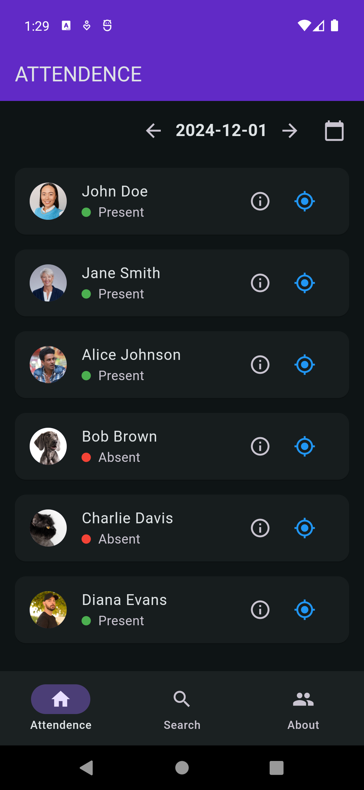

# Attendance App

A Flutter application to manage attendance with features like viewing member details, searching members, and selecting dates.

## Table of Contents

- [Features](#features)
- [Screenshots](#screenshots)
- [Installation](#installation)
- [Usage](#usage)
- [Contributing](#contributing)
- [License](#license)

## Features

- View member details with status and location.
- Search members by name.
- Select dates to view attendance records.
- Responsive design.

## Screenshots



## Installation

### Prerequisites

- [Flutter](https://flutter.dev/docs/get-started/install) (version 2.0 or higher)
- [Dart](https://dart.dev/get-dart)

### Steps

1. **Clone the repository:**

    ```bash
    git clone https://github.com/yourusername/attendance_app.git
    cd attendance_app
    ```

2. **Install dependencies:**

    ```bash
    flutter pub get
    ```

3. **Run the app:**

    ```bash
    Run from the run with or without debugging from the toolbar of vscode or any other IDE
    ```

## Usage

### Project Structure

- `lib/`: Contains the main source code for the application.
  - `main.dart`: Entry point of the application.
  - `views/`: Contains the different views/screens of the application.
    - `home_view.dart`: Home screen of the application.
    - `attendence_view.dart`: Attendance screen.
    - `search_view.dart`: Search screen.
    - `about_view.dart`: About screen.
  - `themes/`: Contains theme-related files.
    - `styles.dart`: Defines the color schemes and text styles.

### Adding Assets

1. **Add images to the assets folder:**

    Place your images in the `assets/images` folder.

2. **Update `pubspec.yaml`:**

    ```yaml
    flutter:
      assets:
        - assets/images/photo1.jpg
        - assets/images/photo2.jpg
        - assets/images/photo3.jpg
        - assets/images/photo4.jpg
    ```

### Running Tests

To run tests, use the following command:

```bash
flutter test
